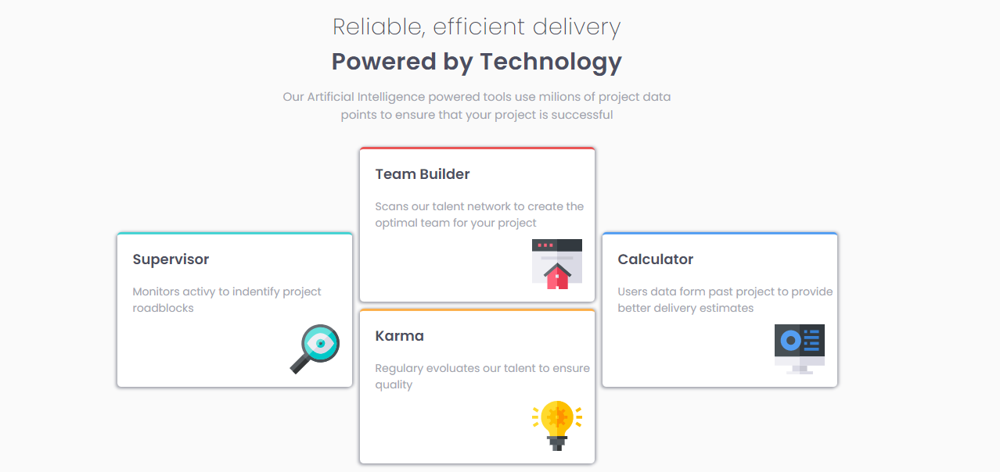
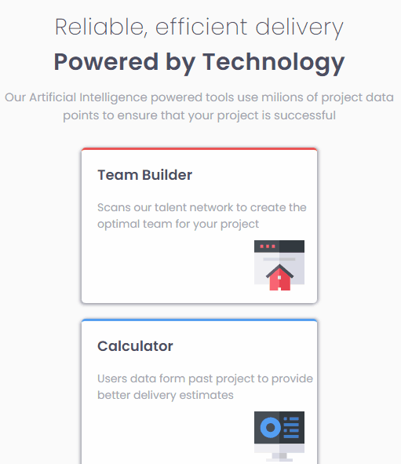

# Frontend Mentor - Four card feature section solution

This is a solution to the [Four card feature section challenge on Frontend Mentor](https://www.frontendmentor.io/challenges/four-card-feature-section-weK1eFYK). Frontend Mentor challenges help you improve your coding skills by building realistic projects.

## Table of contents

- [Overview](#overview)
  - [The challenge](#the-challenge)
  - [Screenshot](#screenshot)
  - [Links](#links)
- [My process](#my-process)
  - [Built with](#built-with)
  - [Continued development](#continued-development)
- [Author](#author)
- [Acknowledgments](#acknowledgments)

## Overview

The challenge was a little complex, due to the fact that I still haven't learned how to style some things, like leaving the images in different positions, one in the top center, another in the left corner, another in the right corner and the last one in the bottom center. I used the relative position property on the container and absolute position on the items, I did that and it worked, but when I went to make the responsive one I couldn't style it the way I wanted. 
Then I decided to make the large responsive desktop separate from the main style, I think it's not correct to do that, but since I couldn't solve it any other way, I did it that way.

### The challenge

the main focus of this challenge was item placements and responsiveness.

### Screenshot

#### Desktop

#### Mobile

### Links

- Live Site URL: [Accees Website](https://ericrdgs.github.io/Card-Feature-Section/)

## My process

I started by creating the html structure with the main, section tags, encompassing the two h2 tags and the p tag in the div, then I inserted another div tag being the container, then I created the items inside the container using divs, h3, p and img. After that I created the reset.css, then the variables.css, and then the style.css that will be the stylization of the document and finally the responsive.css.

### Built with

- Semantic HTML5 markup
- CSS custom properties
- Flexbox
- Position absolute and relative

### Continued development

I want to continue learning and improving the part of creating responsive and also better use the relative position and absolute position property.

## Author

- Github - [EricRDGS](https://github.com/EricRDGS)
- Frontend Mentor - [@EricRDGS](https://www.frontendmentor.io/profile/EricRDGS)

## Acknowledgments

I would like to thank the dev professors twice for the content and for the DevQuest course that I am learning a lot of things and that is why I am managing to solve the challenges, even if I am a beginner and that I make a lot of mistakes when coding, I am gaining a lot of experience in these challenges.
